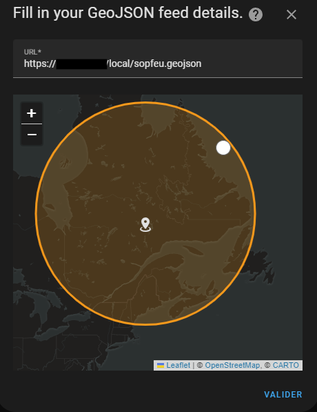
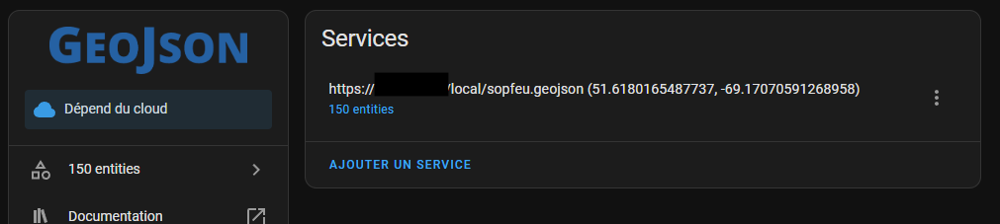
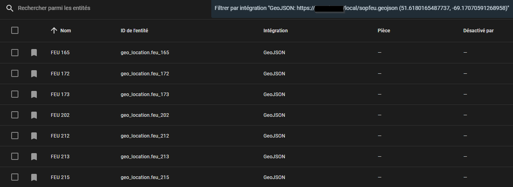
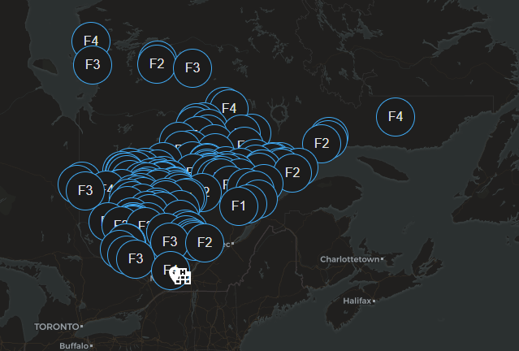
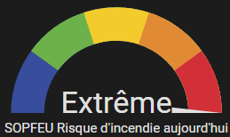

# SOPFEU

La [SOPFEU](https://sopfeu.qc.ca) est un organisme de prévention des incendies qui offre un indice du danger d'incendie ainsi que les recommandations correspondantes à chaque niveau.

## Données

Depuis le printemps 2025 la SOPFEU a mis en place un API permettant d'accédé aux informations sur les risques d'incendie, les feux actifs, les mesures préventive ainsi que des statistiques.

Les détails sur cet API sont disponible ici: https://geofeux.sopfeu.qc.ca/sopfeu-api/swagger/index.html

### Outils de développement

Vous trouverez dans le dossier [donnes/bruno](donnes/bruno) une collection qui peut être importée et utilisée avec l'outil [Bruno](https://www.usebruno.com/).

## Installation

### Home-Assistant

Les configurations Home-Assistant du projet Domo-Québec s'installent sous forme de ["package" Home-Assistant](https://www.home-assistant.io/docs/configuration/packages/). Pour faire l'activation de la fonctionnalitée créé un dossier nommé "packages" à la racine de votre dossier de configuratio Home-Assistant et ajoutez la configuration suivante à votre fichier `configuration.yaml`

```yaml
homeassistant:
  packages: !include_dir_named packages
```

Le dossier [home-assistant/packages](home-assistant/packages) contient deux fichier nommé `sopfeu_risque.yaml` et `sopfeu_feux.yam` qui doit être déplacé dans le dossier "packages" de votre installation Home-Assistant.

#### Configuration

Les fichiers de packages sont fait pour utiliser les coordonnées GPS de votre système Home-Assistant (`zone.home`) pour faire les appels à l'API de la SOPFEU et automatiquement récupérer les informations pour votre emplacement.

Vous pouvez modifier les fichiers pour faire l'ajout d'autres emplacements ou pour récupéré les infomations selon d'autre paramètres disponible dans l'API.

### Autres plateforme

Si vous utilisez une autre plate-forme qu'Home-Assistant et vous intégrez ces données ce serai grandement apprécié que vous partagiez vos configurations pour les ajouter.

## Geojson et alertes

Le capteur de ligne de commande "SOPFEU Feux Geojson" extrait et converti le fichier json des feux actifs en format geojson et le place dans le dossier `www/` afin de le rendre accessible via http(s) avec Home-Assistant. Vous aurez possiblement à ajuster la dernière section de la commande (la destination du fichier) si vous utilisez autre chose que le conteneur officiel d'Home-Assistant.

Une fois le fichier présent vous pouvez configurer l'intégration [GeoJson](https://www.home-assistant.io/integrations/geo_json_events/) et utiliser l’URL `http{s}://{votre HA}:{port au besoin}/local/sopfeu.geojson` afin que l'intégration génère automatiquement des entités pour les feux dans le radius configuré.









Vous pouvez modifié le paramètre `test` de la requêtre et le mettre à `true` pour obtenir des données.

Par la suite une automatisation peut être mise en place pour vous alerter quand il y a un feu déclaré dans votre zone. Un exemple est disponible dans la documentation Home-Assistant pour l'intégration [Geo Location](https://www.home-assistant.io/integrations/geo_location/).

Le sensor de ligne de commande inclut plusieurs données au format GeoJson, par contre l'intégration Home-Assistant n'est pas en mesure de tout les intégrer.

### Interface lovelace

Sous le dossier lovelace vous trouverez deux visualisations à ajouter à votre configuration. Encore une fois les valeurs des secteurs (16) et MRC (78) doivent être remplacées.

#### Jauge



## Listes de différentes valeurs et ID

Vous pouvez retrouver les différents codes de MRC, municipalité et région administrative utilisé par l'API sur le site suivant:
https://www.quebec.ca/gouvernement/portrait-quebec/repertoire-municipalites

Les différentes valeurs utilisé par l'API sont disponible ici:
https://geofeux.sopfeu.qc.ca/sopfeu-api/swagger/index.html

Les valeurs et ID suivants peuvent être utilisés pour filtrer les évènements selon les différentes valeurs. Ils ont été extrait durant une période de feu assez active et devrais contenir la majorité des valeurs possible. Il n'est toutefois pas exclu qu'il en manque, si c'est le cas SVP ouvrez un "issue" github pour qu'on puisse les ajouter.

<details>
<summary>Valeurs de niveau de risque</summary>

| Valeur | Niveau     | Description                                                                                                                                                                                                                                                  |
| ------ | ---------- | ------------------------------------------------------------------------------------------------------------------------------------------------------------------------------------------------------------------------------------------------------------ |
| 1      | BAS        | Risque d’incendie de faible intensité à propagation limitée, c’est le bon moment pour allumer votre feu de camp.                                                                                                                                             |
| 2      | MODÉRÉ     | Risque d’incendie de surface se propageant de façon modérée et se contrôlant généralement bien, faite uniquement des feux de petite dimension (1m X 1m maximum).                                                                                             |
| 3      | ÉLEVÉ      | Risque d’incendie de surface d’intensité modérée à vigoureuse qui pose des défis de contrôle lors du combat terrestre, n’allumez pas si la vitesse du vent est supérieure à 20 km/h.                                                                         |
| 4      | TRÈS ÉLEVÉ | Risque d’incendie de forte intensité avec allumage partiel ou complet des cimes dont les conditions au front sont au-delà de la capacité des équipes terrestres, faites des feux seulement dans des installations munies d’un pare-étincelles réglementaire. |
| 5      | EXTRÊME    | Risque d’incendie de cimes de fortes intensité, qui se propage à grande vitesse et qui peut devenir incontrôlable, évitez de faire des feux.                                                                                                                 |

Source: [https://www.sopfeu.qc.ca/prevention/danger-incendie/](https://www.sopfeu.qc.ca/prevention/danger-incendie/)

</details>
